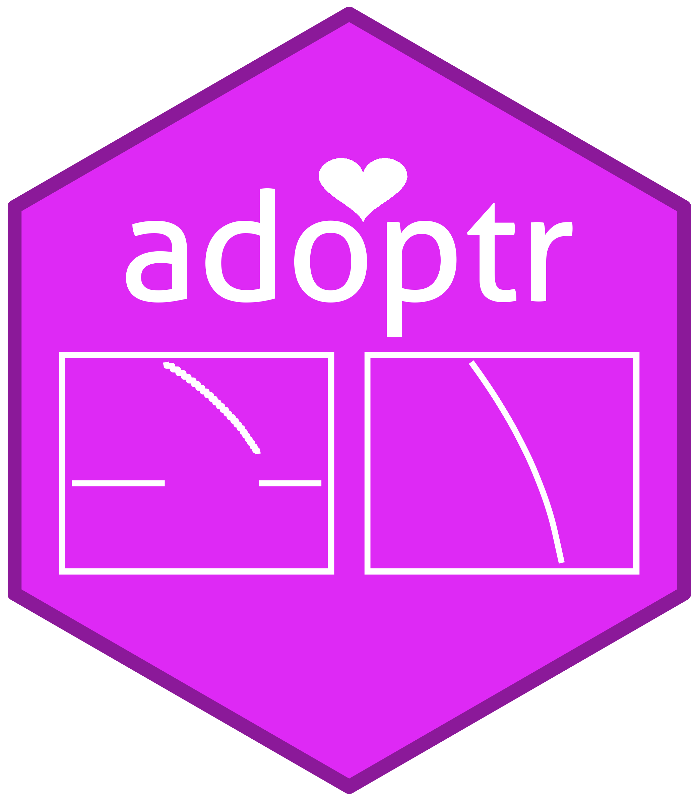

# adoptr [](https://travis-ci.org/kkmann/adoptr)[](https://codecov.io/gh/kkmann/adoptr?branch=master)<a href='https://github.com/kkmann/adoptr'></a>


Adaptive optimal two-stage designs for clinical trials with one or two arms.


## Installation

install the development version directly from [GitHub](https://github.com/) with:

```r
# install.packages("devtools")
devtools::install_github("kkmann/adoptr")
```


## Documentation

The documentation is hosted at https://kkmann.github.io/adoptr.


## Validation [](https://travis-ci.org/kkmann/adoptrValidation)

We provide an extensive validation suite for **adoptr** in the separate 
package [**adoptrValidation**](https://github.com/kkmann/adoptrValidation).
The rationale behind externalizing the validation suit is to keep the main
package test suit lean and focused on checking technical correctness.
We also want to ensure that the validation suit is transparent and accessible.
It is thus implemented as a set of vignettes in the separate package
**adoptrValidation**.
The entire validation report is made accessible at
[https://kkmann.github.io/adoptrValidation/](https://kkmann.github.io/adoptrValidation/).
The website is re-build on a weekly basis to ensure that the presented
validation report is up-to-date with the master branch of **adoptr**.
To validate a specific version of **adoptr**, just download and install
the validation package before building the contained vignettes locally.
