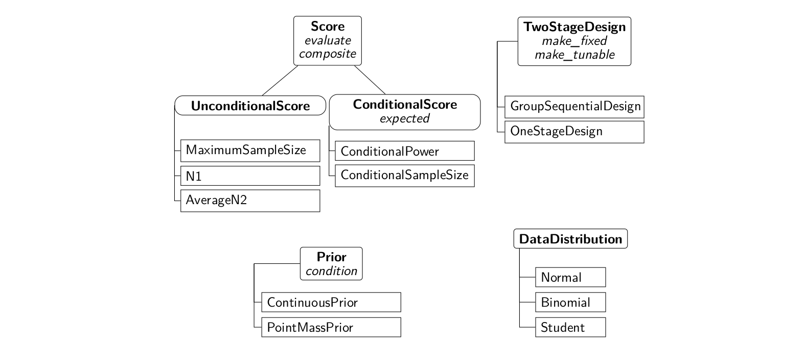

---
author:
  - name: Kevin Kunzmann
    affiliation: Cambridge University
    email: kevin.kunzmann@mrc-bsu.cam.ac.uk
  - name: Maximilian Pilz
    affiliation: University of Heidelberg
    email: pilz@imbi.uni-heidelberg.de
  - name: Carolin Herrmann
    affiliation: Charité Berlin and Berlin Insitute of Health
    email: carolin.herrmann@charite.de
  - name: Geraldine Rauch
    affiliation: Charité Berlin and Berlin Insitute of Health
    email: geraldine.rauch@charite.de
  - name: Meinhard Kieser
    affiliation: University of Heidelberg
    email: meinhard.kieser@imbi.uni-heidelberg.de
title: "The adoptr Package: Adaptive Optimal Designs for Clinical Trials in R"
abstract: > 
  Even though adaptive two-stage designs with unblinded interim analyses
  are becoming increasingly popular in clinical trial designs, there is a
  lack of statistical software to make their application more straightforward.
  The package **adoptr** fills this gap for
  the common case of two-stage one- or two-arm trials with
  (approximately) normally distributed outcomes.
  In contrast to previous approaches, **adoptr** optimizes the
  entire design upfront which allows maximal efficiency.
  To facilitate experimentation with different objective functions,
  **adoptr** supports a flexible way of specifying both (composite)
  objective scores and (conditional) constraints by the user.
  Special emphasis was put on providing measures to aid practitioners with 
  the validation process of the package.
keywords: [optimal design, clinical trials, R]
preamble: >
  \usepackage{amsmath}
output: 
  bookdown::html_document2:
    number_sections: true
    toc: true
date: "`r Sys.Date()`"
bibliography: ref.bib
vignette: >
  %\VignetteIndexEntry{The adoptr Package: Adaptive Optimal Designs for Clinical Trials in R}
  %\VignetteEngine{knitr::rmarkdown}
  %\VignetteEncoding{UTF-8}
---

This manuscript was accepted for publication in the Journal of Statistical Software.


```{r setup, include=FALSE}
library(adoptr)
library(dplyr)
library(tidyr)
library(ggplot2)

buildvignette <- as.logical(Sys.getenv("NOTCRAN", unset = FALSE))

knitr::opts_chunk$set(
    engine='R', 
    highlight=FALSE, 
    prompt=TRUE, 
    tidy=FALSE,
    eval=buildvignette
)
options(prompt = "R> ", continue = "+  ", width = 70, useFancyQuotes = FALSE)
```

```{r maximal-sample-size, cache=FALSE, include=FALSE}
setClass("MaximalSampleSize", contains = "UnconditionalScore")

# Define constructor
MaximalSampleSize <- function() 
  new("MaximalSampleSize")

# Define corresponding evaluate method
setMethod("evaluate", 
          signature("MaximalSampleSize", "TwoStageDesign"),
          function(s, design, optimization = FALSE, ...) {
              x1 <- seq(design@c1f, design@c1e, length.out = 1000)
              ss <- sapply(x1, function(z) adoptr:::n(design, z, round = !optimization))
              return(max(ss))
          }
)

mss <- MaximalSampleSize()
```


```{r plot-opts, include=FALSE}
add_opts <- function(p) {
  p + theme_bw() +
  theme(
    panel.grid   = element_blank(),
    legend.title = element_blank(),
    legend.position = "bottom"
  )
}


# extract legend
g_legend <- function(a.gplot){
  tmp <- ggplot_gtable(ggplot_build(a.gplot))
  leg <- which(sapply(tmp$grobs, function(x) x$name) == "guide-box")
  legend <- tmp$grobs[[leg]]
  return(legend)
}

```


# Background

Confirmatory clinical trials are conducted in a strictly regulated environment.
A key quality criterion put forward by the relevant agencies (@FDA, @EMA)
for a study that is supposed to provide evidence for the regulatory acceptance
of a new drug or treatment is strict type one error rate control.
This requirement was often seen as conflicting with the perceived need to make
trials more flexible by, e.g., early stopping for futility, group-sequential
enrollment, or even adaptive sample size recalculation.
An excellent historical review of the development of the field of adaptive
clinical trial designs and the struggles along the way is given in
@Bauer2015.

In this manuscript, the focus lies exclusively on adaptive two-stage designs
with one unblinded interim analysis.
Both early stopping for futility and efficacy are allowed and
the final sample size as well as the critical value to reject the null hypothesis
is chosen in a data-driven way.
There is a plethora of methods for modifying the design
of an ongoing trial based on interim results
without compromising type one error rate control [@Bauer2015] but the
criteria for deciding *which* adaptation should be performed during an
interim analysis and *when* to perform the interim analysis are still
widely based on heuristics.
Bauer *et al.* mention this issue of guiding adaptive decisions at interim
in a principled (i.e., 'optimal') way by stating that
'[t]he question might arise if potential decisions made at interim stages might
not be better placed to the upfront planning stage.'
Following @MP2011, @JT2015 developed a principle
approach to optimal interim sample size modifications, i.e., to conduct
the interim decision (conditional on interim results) such that it optimizes
an unconditional performance score.
Their approach, however, was still restricted unnecessarily. 
Recently, @variational
extended the work to a fully general variational problem where the optimization
problem for any given performance score (optionally under further constraints)
is solved over both the sample size adaptation function and the critical
value function and the time point of the interim decision simultaneously.
This approach is an application of ideas which
have been put forward in single-arm trials with binary endpoint for several
years (@Englert2013, @Kunzmann2016, @Kunzmann2019) to a setting with
continuous test statistics.
Clearly, by relaxing the problem to continuous sample sizes and test statistics,
the theory becomes much more tractable, and important connections between
conditional and unconditional optimality can be discussed much easier
[@variational].

A key insight from this recent development is the fact that the true challenge
in designing an adaptive trial is less the technical methodology for controlling
the type one error rate but rather the choice of the optimality criterion.
This issue is much less pressing in single-stage designs since most sensible
criteria will be equivalent to minimizing the overall sample size.
Thus, in this case, a 'design' is often completely specified by given
power and type one error rate constraints.
For the more complex adaptive designs, however, there are much more sensible
criteria (minimize maximal sample size, expected sample size, expected costs, etc.)
and the balance between conditional and unconditional properties must be explicitly
specified (cf. Section [6](#sec:Examples)).
This added complexity might be seen as daunting by practitioners, but it is also
a chance for tailoring adaptive designs more specifically to a particular
situation.
The **R**-package [@R] **adoptr** aims at providing a simple
yet customizable interface to specifying a broad class of
objective functions and constraints for single- or two-arm, one- or
two-stage designs with approximately normally distributed endpoints.
The goal of **adoptr** is to enable relatively easy experimentation with
different notions of optimality to shift the focus from *how* to optimize
to *what* to optimize.

In the following, we first give a definition of the problem setting
addressed in **adoptr** and the technicalities of translating the underlying
variational problem to a simple multivariate optimization problem
before motivating the need for an **R**-package.
We then present the core functionality of **adoptr** before
addressing the issue of facilitating validation of open-source software in a
regulated environment and discussing potential future work on **adoptr**.


\clearpage

# Setting {#sec:setting}

We consider the problem of a two-stage, two-arm design to establish
superiority of treatment over placebo with respect to the mean difference.
Assume that to that end data $Y_j^{g, i}$ is observed for
the $j$-th individual of the trial in stage $i\in\{1,2\}$ under treatment
($g=T$) or placebo ($g=C$).
Let $n_i$ be the per-group sample size in stage $i$ and consider
the stage-wise test statistics
$$
  X_i := \frac{\sum_{j=1}^{n_i}Y_j^{T,i} - \sum_{j=1}^{n_i}Y_j^{C,i}}{\sigma\,\sqrt{2\,n_i}}
$$
for $i=1,2$.
Under the assumption that the $Y_j^{g, i}\stackrel{iid}{\sim} F_g$ with
$\boldsymbol{E}[F_T] - \boldsymbol{E}[F_C] = \theta$ and common variance
$\sigma^2$, by the central limit theorem,
the asymptotic distribution of $X_1$ is $\mathcal{N}(\sqrt{n_1/2}\, \theta, 1)$.
Formally, the null hypothesis for the superiority test is thus
$\mathcal{H}_0:\theta\leq 0$.
Based on the interim outcome $X_1$, a decision can be made whether to either
stop the trial early for futility if $X_1<c_1^f$,
to stop the trial early for efficacy (early rejection of the null hypothesis)
if $X_1>c_1^e$, or to enter stage two if $X_1\in[c_1^f, c_1^e]$.
Conditional on proceeding to a second stage, it holds that
$X_2\,|\,X_1\in[c_1^f, c_1^e]\sim\mathcal{N}(\sqrt{n_2/2}\, \theta, 1)$.
In the second stage, the null hypothesis is rejected if and only if $X_2 > c_2(X_1)$
for a stage-two critical value \textit{function} $c_2:x_1\mapsto c_2(x_1)$.
To test $\mathcal{H}_0$ at a significance level of $\alpha$,
the stage-one critical values $c_1^f$ and $c_1^e$ as well as $c_2(\cdot)$
must be chosen in a way that
protects the overall maximal type one error rate $\alpha$.
Note that it is convenient to define $c_2(x_1) = \infty$ if $x_1<c_1^f$ and
$c_2(x_1) = -\infty$ if $x_1>c_1^e$ since the power curve of the design is then
given by $\theta\mapsto\boldsymbol{Pr}_\theta\big[X_2>c_2(X_1)\big]$.
This results in a classical group-sequential design and several methods
were proposed in the literature for
choosing the early-stopping boundaries $c_1^f$ and $c_1^e$
(@OBF, @Pocock) and for defining the stage-two rejection boundary function
$c_2(\cdot)$ (@BK1994, @HO1985).
Often, the inverse-normal combination test [@LW1999] is applied and
$c_2(\cdot)$ is defined as a linear function of the stage-one test-statistic
$$ 
  c_2(x_1) = \frac{c - w_1 x_1}{w_2}‚
$$
for a critical value $c$ and predefined weights $w_1$ and $w_2$.
Most commonly, the stage-wise test statistics are weighted in terms of
their respective sample sizes, i.e., $w_1 = \sqrt{n_1 / (n_1+n_2)}$ and
$w_2 = \sqrt{n_2 / (n_1+n_2)}$.
This choice of the weights is optimal in the sense that it minimizes the
variance of the final test statistic if the assumed sample sizes are
indeed realized [@Zaykin2011].
Note, however, that such prespecified weights become inefficient if the
sample size deviates strongly from the anticipated value
(cf. @Wassmer2016, chapter 6.2.5).
A natural extension of this group-sequential framework is to allow the
second stage sample size to also depend on the observed interim outcome,
i.e., to consider a function $n_2:x_1\mapsto n_2(x_1)$ instead of a
fixed value $n_2$.
Such 'adaptive' two-stage designs are thus completely characterized by a
five-tuple $\mathcal{D}:=\big(n_1, c_1^f, c_1^e, n_2(\cdot), c_2(\cdot)\big)$.

While the required sample size and the critical value for a single-stage design
are uniquely defined by given type one error rate and power constraints,
it is much less clear how the design parameters of a two-stage design should
be selected.
This is especially true since both $n_2$ and $c_2$ are functions and
thus the parameter space is in fact infinite-dimensional.
In order to compare different choices of the design parameters, appropriate
scoring criteria are essential.
A widely applied criterion is the expected sample size under the alternative
hypothesis (see, e.g., @JT2015).
However, there is a variety of further scoring criteria that could be
incorporated or even combined in order to rate a two-stage design.
For instance, conditional power is defined as the probability to reject the
null hypothesis under the alternative given the interim result $X_1=x_1$:
$$
\operatorname{CP}_\theta(x_1) := \boldsymbol{Pr}_\theta \big[X_2 > c_2(X_1) \, \big| \, X_1=x_1\big].
$$
Hence, conditional power is a conditional score given as the power conditioned
on the first-stage outcome $X_1=x_1$.
*Vice versa*, power can be seen as an unconditional score that is obtained by
integrating conditional power over all possible stage-one outcomes, i.e.,
$$
\operatorname{Power_\theta} = \boldsymbol{E}_\theta\big[\operatorname{CP}(X_1)\big].
$$
Intuitively, it makes sense to require a minimal conditional power upon
continuation to the second stage since one might otherwise continue a trial
with little prospect of still rejecting the null hypothesis.
We demonstrate the consequences of this heuristic in Section [6.4](#sec:CP_constraint).
Once the scoring criterion is selected, the design parameters may be chosen
in order to optimize this objective.
The first ones to address this problem were @JT2015
who minimized the expected sample size
$$
\text{ESS}_{\theta}(\mathcal{D}) := \boldsymbol{E}_{\theta} \big[n(X_1) \big] :=
\boldsymbol{E}_{\theta} \big[n_1 + n_2(X_1) \big]
$$
of a two-stage design for given $n_1,c_1^f, c_1^e$ with respect to $n_2(\cdot)$
for given power and type one error rate constraints.
The function $c_2(\cdot)$, however, was not optimized.
Instead, @JT2015 used a combination test approach to derive $c_2$ given
$n_2(\cdot)$ and $n_1$ (cf. Equation \@ref(eq:inverse-normal)).
In @variational, the authors demonstrated that this restriction is not
necessary and that the variational problem of deriving both functions $n_2(\cdot)$
and $c_2(\cdot)$ given $n_1,c_1^f, c_1^e$ to minimize expected sample size can be
solved by analyzing the corresponding Euler-Lagrange equation.
Nesting this step in a standard optimization over the stage-one parameters
allows identifying an optimal set of all design parameters without imposing
parametric assumptions on $c_2(\cdot)$.
As a result, a fully optimal design
$\mathcal{D}^*:=\big(n_1^*, c_1^{f,*}, c_1^{e, *}, n_2^*(\cdot), c_2^*(\cdot)\big)$
for the following general optimization problem was derived
\begin{align}
& \text{minimize} && \operatorname{ESS}_{\theta_1}(\mathcal{D}) &&&& \\
& \text{subject to:}
&& \boldsymbol{Pr}_{\theta_0}\big[X_2>c_2(X_1)\big] &&\leq \alpha, &&&& \\
&&& \boldsymbol{Pr}_{\theta_1}\big[X_2>c_2(X_1)\big] &&\geq 1-\beta &&&&
\end{align}
where $\theta_0=0$.


# Direct variational perspective

In **adoptr**, a simpler solution strategy than solving the Euler-Lagrange
equation locally is applied to the same problem class.
We propose to embed the entire problem in a finite-dimensional parameter
space and solve the corresponding problem over both stage-one and stage-two
design parameters simultaneously using standard numerical libraries.
I.e., we adopt a *direct* approach to solving the variational problem.
This is done by defining a discrete set of pivot points
$\widetilde{x}_1^{(i)}\in(c_1^f, c_1^e), i=1,\ldots,k$, and interpolating
$c_2$ and $n_2$ between these pivots.
We use cubic Hermite splines [@Spline] which are sufficiently flexible,
even for a moderate number of pivots, to approximate any realistic stage-two
sample size and critical value functions.
Since the optimal functions are generally very smooth [@variational] they are
well suited to spline interpolation.
Within the **adoptr** validation report (cf. Section 7)
we investigate empirically the shape of the approximated functions and that
increasing the number of pivots above a value of 5 to 7 does not improve
the optimization results.
The latter implies that a relatively small number of pivot points
appears to be sufficient to obtain valid spline approximations of the optimal
functions.
Note that the pivots are only needed in the continuation region since both
functions are (piecewise) constant within the early stopping regions.
In **adoptr**, the pivots are defined as nodes of a Gaussian quadrature
rule of degree $k$.
This choice allows fast and precise numerical integration of any conditional
score over the continuation region, e.g.,
\begin{align} 
\text{ESS}_{\theta}(\mathcal{D})  =
\int n(x_1) f_{\theta} (x_1) \operatorname{d} x_1
\approx n_1 + \sum_{i=1}^{k} \omega_i\, n_2\big(\widetilde{x}_1^{(i)}\big) f_{\theta}
\big(\widetilde{x}_1^{(i)}\big),
\end{align}
where $f_\theta$ is the probability density function of $X_1\,|\,\theta$ and
$\omega_i$ are the corresponding weights of the integration rule.
The weights only depend on $k$ and the nodes just need to be scaled to
the integration interval.
Consequentially, this objective function is smooth in the optimization
parameters and the resulting optimization problem is of dimension $2k+3$,
where the tuning parameters are $\big(n_1, c_1^f, c_1^e, n_2\big(\widetilde{x}_1^{(1)}\big),
\dots, n_2\big(\widetilde{x}_1^{(k)}\big), c_2\big(\widetilde{x}_1^{(1)}\big),
\dots, c_2\big(\widetilde{x}_1^{(k)}\big)\big)$.
Standard numerical solvers may then be employed to minimize it.
Since **adoptr** enables generic objectives (cf. Section [6.3](#sec:utility_maximization)),
it uses the gradient-free optimizer COBYLA [@COBYLA] internally via
the **R**-package **nloptr** (@nlopt, @nloptr).

Most commonly used unconditional performance scores
$S(\mathcal{D})$ can be seen as expected values over conditional scores
$S(\mathcal{D}|X_1)$ by
$S(\mathcal{D}) = \boldsymbol{E}\big[S(\mathcal{D}|X_1)\big]$
in a similar way as power and
expected sample size.
Any such 'integral score' can be computed quickly and reliably in **adoptr**
via the choice of pivots outlined above.
The correctness of numerically integrated scores is checked in the **adoptr**
validation report by comparing the numerical integrals to simulated results.

Note that we tacitly relaxed all sample sizes to be real numbers in the above
argument while they are in fact restricted to positive integers.
Integer-valued $n_1$ and $n_2$ would, however, lead to an NP-hard
mixed-integer problem.
In our experiments, we found that merely rounding both $n_1$ and $n_2$ after
the optimization works fine.
The extensive validation suite (cf. Section 7) evaluates 
by numerical integration and simulation whether the included constraints
are fulfilled for optimal designs with rounded sample sizes.
Up to now, neither the constraints were violated nor an efficiency loss with
respect to the underlying objective function was observed.
In theory, one could re-adjust the decision boundaries for these rounded sample
sizes, but we failed to see any practical benefit from this, even for small
trials where the rounding error is largest (data not shown).


# The need for an R package

@Bauer2015 state that adequate statistical software for adaptive designs
'is increasingly needed to evaluate the adaptations and to find reasonable
strategies'.

Commercial software such as JMP\textsuperscript{\textregistered} [@jmp2020]
or Minitab\textsuperscript{\textregistered} [@minitab2020] allow planning
and analyzing a wide range of experimental setups.
Amongst others, they provide tools for randomization,
stratification, block-building, or D-optimal designs.
These general purpose statistical software packages do not, however, allow
planning of more specialized multi-stage designs encountered in clinical trials.
For group-sequential designs, some planning capabilities are available in the
**SAS**\textsuperscript{\textregistered} procedure `seqdesign` [@sas2020],
PASS\textsuperscript{\textregistered} [@pass2019], or
ADDPLAN\textsuperscript{\textregistered} [@addplan2020].
East\textsuperscript{\textregistered} [@east2020] also supports design, simulation and
analysis of experiments with interim analyses.
The East ADAPT\textsuperscript{\textregistered} and the
East SURVADAPT\textsuperscript{\textregistered} modules support sample size recalculation.
Furthermore, there are various open-source **R**-packages for the
analysis of multi-stage designs.
The package **adaptTest** [@adaptTest] implements combination tests for
adaptive two-stage designs.
**AGSDest** [@AGSDest] allows estimation and computation of
confidence intervals in adaptive group-sequential designs.
More detailed overviews on software for adaptive clinical trial designs can
be found in @Bauer2015, chapter 6, or in @Tymofyeyev2014.
The choice of software for optimally designing two- or multi-stage designs,
however, is much more limited.
Current **R**-packages concerned with optimal clinical trial designs
are **OptGS** (@OptGS, @OptGS_pub) and **rpact** [@rpact].
These are, however, exclusively focused on group-sequential designs and
lack the ability to specify custom objective functions and constraints.

The lack of flexibility in formulating the objective function
and constraints might lead to off-the-shelf solutions not entirely
reflecting the needs of a particular trial consequentially resulting in inefficient designs.
The **R**-package **adoptr** aims at providing a simple and
interactive yet flexible interface for addressing a range of optimization problems
encountered with two-stage one- or two-arm clinical trials.
In particular, **adoptr** allows to model *a priori* uncertainty
over $\theta$ via prior distributions and thus supports optimization under
uncertainty (cf. Section [6.2](#sec:uncertainty)).
**adoptr** also supports the combination of conditional (on $X_1$)
and unconditional scores and constraints to address concerns such as
type-one-error-rate control (unconditional score)
and, e.g., a minimal conditional power (conditional score) simultaneously
(cf. Section [6.3](#sec:utility_maximization)).
To facilitate the adoption of these advanced trial designs in the clinical trials
community, **adoptr** also features an extensive test and validation suite
(cf. Section 7).

In the following, we outline the key design principles for **adoptr**.

1. **Interactivity:**
A major advantage of the **R**-programming language is its
powerful metaprogramming capabilities and flexible class
system.
With a combination of non-standard evaluation and
S4 classes, we hope to achieve a structured and modular way of
expressing
optimization problems in clinical trials that integrates nicely with an
interactive workflow.
We feel that a step-wise problem formulation via the creation of
modular intermediate objects, which can be explored and modified separately,
encourages exploration of different options.
2. **Reliability:**
A crux in open-source software development for clinical trials is achieving
demonstrable validation.
Potential users need to be convinced of the software quality and need to be
able to comply with their respective validation requirements which often
require the ability to produce a validation report.
This burden typically results in innovative software not being used at all -
simply because the validation effort cannot be stemmed.
We address this issue with an extensive unit test suite and a companion
validation report (cf. Section 7).
3. **Extensibility:**
We do not want to impose a particular choice of scores or constraints or
promote a particular notion of optimality for clinical trial designs.
In cases where the composition of existing scores is not sufficient,
the object-oriented approach of **adoptr** facilitates the definition of custom
scores and constraints that seamlessly integrate with the remainder of the package.


# Adoptr's structure {#sec:structure}

The package **adoptr** is based on **R**'s S4 class system.
This allows to use multiple dispatch on the classes of multiple arguments 
to a method.
In this section, the central components of **adoptr** are described briefly.
Figure \@ref(fig:class-diagram) gives a structural overview of the main
classes in **adoptr**.

```{r class-diagram, out.width='100%', echo=FALSE, fig.cap='Overview of the most important classes and methods (in italic) in the R-package adoptr. A subclassing relationship is indicated by a connecting line to the  corresponding super class above it. The most important methods for each class are listed under the respective class name in italic font.'}

```

To compute optimal designs, an object of class `UnconditionalScore`
must be defined as objective criterion.
**adoptr** distinguishes between `ConditionalScore`s and
`UnconditionalScore`s (cf. Section [2](#sec:setting)).
All `Score`s can be evaluated using the method `evaluate`.
For unconditional scores, this method only requires a `Score` object and a 
`TwoStageDesign` object,
for conditional scores (like conditional power), it also requires the interim 
outcome $x_1$.
Note that any `ConditionalScore` $S(\mathcal{D}|X_1=x_1)$
can be converted to an `UnconditionalScore`
$S(\mathcal{D}) = \boldsymbol{E}\big[S(\mathcal{D}|X_1)\big]$ using the method
`expected`.
The two most widely used conditional scores are pre-implemented as
`ConditionalPower` and `ConditionalSampleSize`.
Their unconditional counterparts are `Power` and 
`ExpectedSampleSize`.
Further predefined unconditional scores are `AverageN2`, evaluating the average
of the stage-two sample size (improper prior) and 
`N1` measuring the first-stage sample size.
These scores may be used for regularization if variable stage-two sample sizes
or a high stage-one sample size are to be penalized.
Users are free to define their own `Score`s
(cf. the vignette 'Defining New Scores' [@new-scores]).
Moreover, different `Score`s can be composed to a single one by the
function `composite` (cf. Section [6.3](#sec:utility_maximization)).
Both conditional and unconditional scores can also be used to define 
constraints - the most common case being constraints for power and
maximal type one error rate.
The function `minimize` takes an unconditional score as objective and
a set of constraints and optimizes the design parameters.

In **adoptr**, different kinds of designs are implemented.
The most frequently applied case is a `TwoStageDesign`, i.e., a design
with one interim analysis and a sample size function that varies with the
interim test statistic.
Another option is the subclass `GroupSequentialDesign` which restricts
the sample size function on the continuation region to a single number, i.e., 
${n_2(x_1) = n_2\ \forall x_1\in[\,c_1^f, c_1^e\,]}$.
Additionally, **adoptr** supports the computation of optimal
`OneStageDesign`s, i.e., designs without an interim analysis.
Technically, one-stage designs are implemented as subclasses of `TwoStageDesign`
since they can be viewed as the limiting case for $n_2\equiv0$ and $c_1^f=c_1^e$.
Hence, all methods that are implemented for `TwoStageDesign`s also work
for `GroupSequentialDesign`s and `OneStageDesign`s.
Users can chose to keep some elements of a design fixed during optimization
using the methods `make_fixed` (cf. Section [6.5](#sec:make_fixed)).

The joint data distribution in **adoptr** consists of two elements.
The distribution of the test statistic is specified by an object of class
`DataDistribution`.
Currently, the two options `Normal` and `Binomial` are implemented.
The logical variable `two_armed` allows the differentiation between 
one- and two-armed trials.
Furthermore, **adoptr** supports prior distributions on the effect size.
These can be `PointMassPrior`s (cf. Section [6.1](#sec:standard_case))
as well as `ContinuousPrior`s (cf. Section [6.2](#sec:uncertainty)).

In the following section, more hands on examples demonstrate the capabilities of
**adoptr** and its syntax.


# Examples {#sec:Examples}

## Standard case {#sec:standard_case}
Consider the case of a randomized controlled clinical trial where efficacy is
to be demonstrated in terms of superiority of the treatment over placebo
with respect to the population mean difference $\theta$ of an outcome.
Let the null hypothesis be $\mathcal{H}_0:\theta\leq 0$.
Assume that the maximal type one error rate is to be controlled at a one-sided level
$\alpha=2.5\%$ and a minimal power of $90\%$ at a point alternative of
$\theta_1=0.3$ is deemed necessary.
For simplicity's sake, we assume $\sigma^2=1$ without loss of generality.
The required sample size for a one-stage design with analysis by the
one-sided two-sample $t$-test would then be roughly
`r ceiling(pwr::pwr.t.test(d = .3, sig.level = .025, power = .9, alternative = "greater")$n)`
per group.

Using **adoptr**, the two-stage design minimizing the expected sample size under
the alternative hypothesis can be derived for the very same situation.
First, the data distribution is specified to be normal.
The `two_armed` parameter allows to switch between single-armed and
two-armed trials.
```{r case-1-data-distribution}
datadist <- Normal(two_armed = TRUE)
```
In this example, we use simple point priors for both the null and
alternative hypotheses.
The hypotheses and the corresponding scores (power values) can be
specified as:
```{r case-1-hypotheses}
null        <- PointMassPrior(theta = .0, mass = 1.0)
alternative <- PointMassPrior(theta = .3, mass = 1.0)
power       <- Power(dist = datadist, prior = alternative)
toer        <- Power(dist = datadist, prior = null)
```
A `Power` score requires the data distribution and the prior
to be specified.
For this example, we choose `PointMassPrior`s with the entire probability mass
of $1$ on a single point, the null hypothesis $\theta = 0$
to compute the type one error rate, and the alternative hypothesis $\theta = 0.3$
to compute the power.
The objective function is the expected sample size under the alternative.
```{r case-1-ess}
ess <- ExpectedSampleSize(dist = datadist, prior = alternative)
```
Since **adoptr** internally relies on the COBYLA implementation of
**nloptr**, an initial design is required.
A heuristic initial choice is provided by the function `get_initial_design`.
It is based on a fixed design that fulfills constraints on type one error rate
and power.
The type of the design (two-stage, group-sequential, or one-stage) and the
data distribution have to be defined.
For the Gaussian quadrature used during optimization, one also has to specify
the order of the integration rule, i.e., the number of pivot points between
early stopping for futility and early stopping for efficacy.
In practice, order 7 turned out to be
sufficiently flexible to obtain valid results (data not shown).
```{r}
initial_design <- get_initial_design(theta = 0.3, alpha = 0.025,
                                     beta = 0.1, type = "two-stage",
                                     dist = datadist, order = 7)
```
It is easy to check that the initial design does not fulfill any of the
constraints (minimal power of 90\% and maximal type one error rate of 2.5\%)
with equality by evaluating the respective scores:
```{r, collapse=FALSE}
evaluate(toer, initial_design)
evaluate(power, initial_design)
```
Alternatively, one might also `evaluate` a constraint object directly via
```{r, collapse=FALSE}
evaluate(toer  <= .025, initial_design)
evaluate(power >= .9, initial_design)
```
All constraint objects are normalized to the form
$h(\mathcal{D}) \leq 0$ (unconditional) or
$h(\mathcal{D}, x_1) \leq 0$ (conditional on $X_1=x_1$).
Calling `evaluate` on a constraint object then simply returns the left-hand
side of the inequality.
The actual optimization is started by invoking `minimize`
```{r case-1-optimization}
opt1 <- minimize(ess, subject_to(power >= 0.9, toer  <= 0.025),
                 initial_design)
```
The modular structure of the problem specification is intended to facilitate the
inspection or modification of individual components.
The call to `minimize()` is designed to be as close as possible to
the mathematical formulation of the optimization problem
and returns both the optimized design (`opt1$design`) as well as the full
**nloptr** return value
with details on the optimization procedure (`opt1$nloptr_return`).

A `summary` method for objects of the class `TwoStageDesign` is available
to quickly evaluate a set of `ConditionalScores` such as conditional power
as well as `UnconditionalScores` such as power and expected sample size.
```{r}
cp <- ConditionalPower(dist = datadist, prior = alternative)
summary(opt1$design, "Power" = power, "ESS" = ess, "CP" = cp)
```
**adoptr** also implements a default plot method for the overall sample size and
the stage-two critical value as functions of the first-stage test statistic $x_1$.
The plot method also accepts additional `ConditionalScores` such as conditional power.
Calling the plot method produces several plots with the interim test statistic
$x_1$ on the $x$-axis and the respective function on the $y$-axis.
```{r, standard-case, fig.height=2.25*1.25, fig.width=6*1.25, out.width='100%', fig.cap="Optimal sample size, critical value, and conditional power plotted against the interim test statistic (built-in plot method)."}
plot(opt1$design, `Conditional power` = cp)
```
Note the slightly bent shape of the $c_2(\cdot)$ function
(cf. Figure \@ref(fig:standard-case), second plot).
For two-stage designs based on the inverse-normal combination function, $c_2(\cdot)$
would be linear by definition (cf. Equation \@ref(eq:inverse-normal)).
Since the optimal shape of $c_2(\cdot)$ is not linear (but almost), inverse-normal
combination methods are slightly less efficient (cf. @variational for a more
detailed discussion of this issue).


## Optimization under uncertainty {#sec:uncertainty}
**adoptr** is not limited to point priors but also supports arbitrary
continuous prior distributions.
Consider the same situation as before but now assume that the prior over
the effect size is given by a much more realistic truncated normal
distribution with mean $0.3$ and standard deviation $0.1$,
i.e., $\theta\sim\mathcal{N}_{[-1, 1]}(0.3, 0.1^2)$.
The order of integration is set to 25 to obtain precise results.
```{r}
prior <- ContinuousPrior(
  pdf     = function(theta) dnorm(theta, mean = .3, sd = .1),
  support = c(-1, 1),
  order   = 25)
```
The objective function is the expected sample size under the prior
```{r case-2-ess}
ess <- ExpectedSampleSize(dist = datadist, prior = prior)
```
and we replace power with expected power
$$
\boldsymbol{E} \Big[
\boldsymbol{Pr}_\theta\big[X_2>c_2(X_1)\big] \, \Big| \, \theta \geq 0.1 \Big]
$$
which is the expected power given a relevant effect (here we define the minimal
relevant effect as $0.1$).
This score can be defined in **adoptr** by first conditioning the prior.
```{r case-2-pwr-mcr}
epower <- Power(dist = datadist, prior = condition(prior, c(.1, 1)))
```
The optimal design is then given by
```{r case-2-optimization, warning=FALSE}
opt2 <- minimize(ess, subject_to(epower >= 0.9, toer <= 0.025),
                 initial_design,
                 opts = list(algorithm = "NLOPT_LN_COBYLA",
                             xtol_rel = 1e-5, maxeval = 20000))
```
Note that the increased complexity of the problem requires a larger maximal
number of iterations for the underlying optimization procedure.
**adoptr** exposes the **nloptr** options via the argument `opts`.
In cases where the maximal number of iterations is exhausted, a warning is
thrown.

The expected sample size under the prior of the obtained optimal design equals
`r if (buildvignette) round(evaluate(ess, opt2$design), 1)`.
This points out the increased uncertainty on $\theta$ since the expected sample
size under the prior of the optimal design from Section [6.1](#sec:standard_case)
amounts to a lower value of `r if (buildvignette) round(evaluate(ess, opt1$design), 1)`.


## Utility maximization and composite scores {#sec:utility_maximization}
**adoptr** also supports composite scores.
This can be used to derive utility maximizing designs by defining an objective
function combining both expected power and
expected sample size instead of imposing a hard constraint on expected power.
For example, in the above situation one could be interested in a
utility-maximizing design.
Here, we consider the utility function
$$
u(\mathcal{D}) := 200000\, \boldsymbol{E} \Big[
\boldsymbol{Pr}_\theta\big[X_2>c_2(X_1)\big] \, \Big| \, \theta \geq 0.1 \Big] - \boldsymbol{E}\Big[n(X_1)^2\Big],
$$
thus allowing a direct trade-off between power and sample size.
Here, the expected \textit{squared} sample size is chosen because the
practitioner might prefer flatter sample size curves.
This can be achieved with expected squared sample size by penalizing large
sample sizes stronger than low sample sizes.
Furthermore, there is no longer a strict expected power constraint but the
expected power becomes part of the utility function
which allows a direct trade-off between the two quantities.
This can be interpreted as a pricing mechanism (cf. @Kunzmann2019):
Every additional percent point of expected power has a (positive) value of
$\$ 2'000$ while an increase of $\boldsymbol{E}\big[n(X_1)^2\big]$ by $1$
incurs costs of $\$ 1$.
The goal is then to compute the design which is maximizing the overall utility
defined by the utility function $u(\mathcal{D})$ (or equivalently minimize costs).

A composite score can be defined via any valid numerical **R**
expression of score objects.
We start by defining a score for the expected quadratic sample size
```{r}
`n(X_1)`      <- ConditionalSampleSize()
`E[n(X_1)^2]` <- expected(composite({`n(X_1)`^2}),
                          data_distribution = datadist,
                          prior = prior)
```
before minimizing the corresponding negative utility without a hard
expected power constraint.
```{r case-3-optimization}
opt3 <- minimize(composite({`E[n(X_1)^2]` - 200000*epower}),
                 subject_to(toer <= 0.025), initial_design)
```

The expected power of the design is
```{r power-utility}
evaluate(epower, opt3$design)
```

The three optimal designs which have been computed so far are depicted
in a joint plot (cf. Figure \@ref(fig:comparison)).
The design using the continuous prior requires higher sample sizes
due to the higher uncertainty about $\theta$.
The utility maximization approach results in similar shapes of $n(\cdot)$ and
$c_2(\cdot)$ as the constraint optimization.
However, the sample sizes are lower due to the design's lower power which is
only possible by allowing a trade-off between expected power and expected sample size.
In particular, the maximal sample size of the utility-based design equals
`r if (buildvignette) evaluate(mss, opt3$design)` and is distinctly smaller than in the case of a
hard power constraint under a
point prior (maximal sample size: `r if (buildvignette) evaluate(mss, opt1$design)`)
or a continuous prior (maximal sample size: `r if (buildvignette) evaluate(mss, opt2$design)`).

```{r, comparison, echo=FALSE, warning=FALSE, fig.height=2.25*1.25, fig.width=6*1.25, out.width='100%', fig.cap="Comparison of optimal designs under a point prior, a continuous prior, and a utility maximization approach."}

x1    <- seq(0, 3, by = .01)
theta <- seq(0, .4, by = .01)

plot_data_1 <- tibble(
    type   = c("Point Prior", "Continuous Prior", "Utility Maximization"),
    design = c(opt1$design, opt2$design, opt3$design)
  ) %>%
  group_by(type) %>%
  do(
    x1 = x1,
    n  = adoptr::n(.$design[[1]], x1),
    c2 = c2(.$design[[1]], x1)
  )  %>%
  unnest(., cols = c(x1, n, c2)) %>%
  mutate(
    section = ifelse(
      is.finite(c2),
      "continuation",
      ifelse(c2 == -Inf, "efficacy", "futility")
    )
  ) %>%
  gather(variable, value, n, c2)

plot_data_2 <- tibble(
    type   = c("Point Prior", "Continuous Prior", "Utility Maximization"),
    design = c(opt1$design, opt2$design, opt3$design)
  ) %>%
  group_by(type) %>%
  do(
    theta = theta,
    pow   = sapply(theta,
                   function(d) {
                       evaluate(Power(datadist, PointMassPrior(d, 1)), .$design[[1]])
                     })
  )  %>%
  unnest(., cols = c(theta, pow)) %>%
  gather(variable, value, pow)


p1 <- {
  ggplot(filter(plot_data_1, variable == "n"), aes(x1, value, color = type)) +
    xlab(expression(x[1])) +
    geom_line(aes(group = interaction(section, type))) +
    scale_y_continuous("n", limits = c(0, 550), breaks = seq(0, 500, 100))
  } %>%
  add_opts

p2 <- {
  ggplot(filter(plot_data_1, variable == "c2"), aes(x1, value, color = type)) +
    xlab(expression(x[1])) +
    geom_line(aes(group = interaction(section, type))) +
    scale_y_continuous(expression(c[2]), breaks = seq(0, 5, by = .5))
} %>%
  add_opts


p3 <- {
  ggplot(filter(plot_data_2, variable == "pow"), aes(theta, value, color = type)) +
    xlab(expression(theta)) +
    geom_line(aes(group = type)) +
    scale_y_continuous("Power", breaks = seq(0, 1, .1))
} %>%
  add_opts


gridExtra::grid.arrange(
  gridExtra::arrangeGrob(
    p1 + theme(legend.position = "none"),
    p2 + theme(legend.position = "none"),
    p3 + theme(legend.position = "none"),
    nrow = 1
  ),
  g_legend(p1),
  nrow = 2,
  heights = c(10, 1)
)
```


## Conditional power constraint {#sec:CP_constraint}
**adoptr** also allows the incorporation of hard constraints on conditional
scores such as conditional power.
Conditional power constraints are intuitively sensible to make sure that
a trial which continues to the second stage maintains a high chance of rejecting
the null hypothesis at the end.
For this example, we return to the case of a point prior on the effect size.
```{r case-4-hypotheses}
prior <- PointMassPrior(theta = .3, mass = 1.0)
ess   <- ExpectedSampleSize(dist = datadist, prior = prior)
cp    <- ConditionalPower(dist = datadist, prior = prior)
power <- expected(cp, data_distribution = datadist, prior = prior)
```
Here, power is derived as expected score of the corresponding conditional
power.
A conditional power constraint is added in exactly the same way as
unconditional constraints.
```{r}
opt4 <- minimize(ess, subject_to(toer <= 0.025, power >= 0.9, cp >= 0.8),
                 initial_design)
```

Comparing the optimal design that has been computed here with the same constraints
but without a conditional power constraint (cf. beginning of this chapter),
the optimal design with the additional constraint requires larger sample sizes in
regions where the conditional power would usually be below the given threshold
(cf. Figure \@ref(fig:cp-constraint), first and third plot).
Overall, the additional constraint reduces the feasible solution space and
consequently increases the expected sample size
(`r if (buildvignette) evaluate(ess, opt4$design) %>% round(1)` with conditional power constraint
vs. `r if (buildvignette) evaluate(ess, opt1$design) %>% round(1)` without).
This example demonstrates, that any additional binding conditional constraints
do come at costs for global optimality.
Whether or not the loss in unconditional performance is outweighed by
more appealing conditional properties must be decided on a case by case basis.


```{r, cp-constraint, echo=FALSE, warning=FALSE, fig.height=2.25*1.25, fig.width=6*1.25, out.width="100%", fig.cap="Optimal designs with and without conditional power constraint."}
x1 <- seq(0, 3, by = .01)

plot_data_2 <- tibble(
  type   = c("No CP constraint", "With CP constraint"),
  design = c(opt1$design, opt4$design)
) %>%
    group_by(type) %>%
    do(
        x1 = x1,
        n  = adoptr::n(.$design[[1]], x1),
        c2 = c2(.$design[[1]], x1),
        cp = evaluate(cp, .$design[[1]], x1)
    )  %>%
    unnest(., c(x1, n, c2, cp)) %>%
    mutate(
        section = ifelse(
            is.finite(c2),
            "continuation",
            ifelse(c2 == -Inf, "efficacy", "futility")
        )
    ) %>%
    gather(variable, value, n, c2, cp)

add_opts <- function(p) {
  p + xlab(expression(x[1])) +
  theme_bw() +
  theme(
    panel.grid   = element_blank(),
    legend.title = element_blank(),
    legend.position = "bottom"
  )
}


p1_2 <- {
  ggplot(filter(plot_data_2, variable == "n"), aes(x1, value, color = type)) +
      geom_line(aes(group = interaction(section, type))) +
      scale_y_continuous("n", limits = c(0, 500), breaks = seq(0, 500, 100))
} %>%
  add_opts

p2_2 <- {
  ggplot(filter(plot_data_2, variable == "c2"), aes(x1, value, color = type)) +
      geom_line(aes(group = interaction(section, type))) +
      scale_y_continuous(expression(c[2]), breaks = seq(0, 5, by = .5))
} %>%
  add_opts

p3_2 <- {
  ggplot(filter(plot_data_2, variable == "cp"), aes(x1, value, color = type)) +
      geom_line(aes(group = interaction(section, type))) +
      scale_y_continuous("Conditional Power", breaks = seq(0, 1, by = .1))
} %>%
  add_opts


gridExtra::grid.arrange(
  gridExtra::arrangeGrob(
    p1_2 + theme(legend.position = "none"),
    p2_2 + theme(legend.position = "none"),
    p3_2 + theme(legend.position = "none"),
    nrow = 1
  ),
  g_legend(p1_2),
  nrow = 2,
  heights = c(10, 1)
)
```


## Keeping design parameters fixed {#sec:make_fixed}

In clinical practice, non-statistical considerations may impose direct
constraints on design parameters.
For instance, a sponsor might be subject to logistical constraints that render it
necessary to design a trial with a specific stage one sample size.
Returning to the standard case discussed in Section [6.1](#sec:standard_case),
assume that a stage-one per-group sample size of exactly 80 individuals per group
is required ($n_1 = 80$) instead of the optimal value of $n_1^* = `r if (buildvignette) round(opt1$design@n1)`$.
Furthermore, assume that the sponsor wants to stop early for futility if and only
if there is a negative effect size at the interim analysis, i.e., $c_1^f = 0$.
**adoptr** supports such considerations by allowing to fix specific values of
a design:
```{r}
initial_design@n1  <- 80
initial_design@c1f <- 0
initial_design     <- make_fixed(initial_design, n1, c1f)
```
Any 'fixed' parameter will be kept constant during optimization.
Note that it is also possible to 'un-fix' parameters again using the
`make_tunable` function.
```{r, message=FALSE}
opt5 <- minimize(ess, subject_to(toer <= 0.025, power >= 0.9),
                 initial_design)
```
Figure \@ref(fig:tunable) visually compares the original design with the new,
more restricted design.
The designs are qualitatively similar, but fixing $n_1$ and $c_1^f$ does
come at the price of slightly increased expected sample size
(`r if (buildvignette) round(evaluate(ess, opt5$design), 1)` compared to
`r if (buildvignette) round(evaluate(ess, opt1$design), 1)` in the less restricted case).

```{r, tunable, echo=FALSE, warning=FALSE, fig.height=2.25*1.25, fig.width=6*1.25, out.width="100%", fig.cap="Comparison of fully optimal design and optimal design with fixed first-stage sample size."}

x1    <- seq(-.5, 3, by = .01)
theta <- seq(-.2, .5, by = .01)

plot_data_1 <- tibble(
    type   = c("Optimal", "Optimal with fixed n1"),
    design = c(opt1$design, opt5$design)
  ) %>%
  group_by(type) %>%
  do(
      x1 = x1,
      n  = adoptr::n(.$design[[1]], x1),
      c2 = c2(.$design[[1]], x1)
  )  %>%
  unnest(., c(x1, n, c2)) %>%
  mutate(
      section = ifelse(
          is.finite(c2),
          "continuation",
          ifelse(c2 == -Inf, "efficacy", "futility")
      )
  ) %>%
  gather(variable, value, n, c2)


plot_data_2 <- tibble(
    type   = c("Optimal", "Optimal with fixed n1"),
    design = c(opt1$design, opt5$design)
  ) %>%
  group_by(type) %>%
  do(
      theta = theta,
      pow   = sapply(theta,
                     function(d) {
                       evaluate(ExpectedSampleSize(datadist, PointMassPrior(d, 1)), .$design[[1]])
                     })
  )  %>%
  unnest(., cols  = c(theta, pow)) %>%
  gather(variable, value, pow)


p1 <- {
  ggplot(filter(plot_data_1, variable == "n"), aes(x1, value, color = type)) +
      xlab(expression(x[1])) +
      geom_line(aes(group = interaction(section, type))) +
      scale_y_continuous("n", limits = c(0, 500), breaks = seq(0, 500, 100))
} %>%
  add_opts

p2 <- {
  ggplot(filter(plot_data_1, variable == "c2"), aes(x1, value, color = type)) +
      xlab(expression(x[1])) +
      geom_line(aes(group = interaction(section, type))) +
      scale_y_continuous(expression(c[2]), breaks = seq(0, 5, by = .5))
} %>%
  add_opts


p3 <- {
  ggplot(filter(plot_data_2, variable == "pow"), aes(theta, value, color = type)) +
      xlab(expression(theta)) +
      geom_line(aes(group = type)) +
      scale_y_continuous("Expected Sample Size") +
      geom_vline(xintercept = 0.3, colour = "grey", size=0.3)
} %>%
  add_opts


gridExtra::grid.arrange(
  gridExtra::arrangeGrob(
    p1 + theme(legend.position = "none"),
    p2 + theme(legend.position = "none"),
    p3 + theme(legend.position = "none"),
    nrow = 1
  ),
  g_legend(p1),
  nrow = 2,
  heights = c(10, 1)
)
```


# Validation concept {#sec:validation}

The conduct and analysis of clinical trials is a highly regulated process.
An essential requirement being put forward in Title 21 CRF
(code of federal regulations) Part 11 is the need to
validate any software used to work with or produce records [@crf11].
The exact scope of regulations such as CRF 11 is sometimes difficult to assess,
and it is not always clear which regulations apply to **R**
packages used in a production environment [@r-fda].
Irrespective of the applicability of the CRF 11 to **adoptr**, the design
of a clinical trial is undoubtedly crucial and package authors should provide
extensive evidence of the correctness of the package functionality.
Additionally, this evidence should be easily accessible and human-readable.
The latter requirement is a consequence of the fact that,
again following CRF 11 and the remarks in @r-fda,
a 'validated **R**-package' does not exist
since the validation process must always be implemented by the responsible user.

To facilitate the process of validation as much as possible,
**adoptr** implements the following measures:

1. *Open-source development:* The entire development of **adoptr** is
organized around a public GitHub.com repository (https://github.com/kkmann/adoptr).
Anybody can freely download the source code, browse the development history,
raise issues, or contribute to the code base by opening pull requests.
2. *CRAN releases:* Regular CRAN [@cran] releases of updated versions maximize
visibility and add an additional layer of testing and quality control.
New features can be implemented and tested in the (public) development version
on GitHub before pushing new releases to CRAN.
3. *Unit testing:* **adoptr** implements an extensive test suite using the
package **testthat** (@testthat, @testthat_pub) which allows spotting
new errors early during development and localizing them quickly.
Together with continuous integration (cf. below), this helps to improve quality
and speeds up the development process.
4. *Continuous Integration / Continuous Deployment:* **adoptr** makes extensive
use of the continuous integration and deployment services of
Travis-CI [@travis].
Each new commit on the public GitHub.com repository is immediately run through
the automated testing pipeline using the Travis-CI build service.
Merges to the master branch are only possible after tests were
passed successfully and a contributor reviewed and approved the changes
('branch protection system').
Continuous deployment allows automatically updating code-coverage statistics
(cf. below) and up-to-date online documentation (cf. below).
5. *Coverage analyses:* To document the extent to which the test suite covers
the package code, **adoptr** relies on the codecov [@codecov]
online service in conjunction with the **covr** package [@covr].
It provides statistics on the proportion of lines visited at least
once during testing (currently 100\%) and enables easy online publication of the results.
6. *Online documentation:* 
Beyond the standard documentation generated using **roxygen2** [@roxygen],
we also make use of the **pkgdown** [@pkgdown] package and the free GitHub pages
service to publish a static **html** version of the documentation online at
https://kkmann.github.io/adoptr/.
This includes both the function reference and the vignettes in a consistent and
easily accessible format.
The online documentation experience is further improved by the integration of
a full-text docsearch engine (https://www.algolia.com/ref/docsearch).
7. *Extended validation report:* There are limits to what can be done in the
standard unit testing framework within a package itself
(cf. https://cran.r-project.org/web/packages/policies.html).
Long-running test suites also hinder active development with a strict
continuous integration and continuous deployment (CI/CD)
workflow since changes to the master branch require passing the automated tests.
We, therefore, decided to restrict the internal unit tests to a bare minimum with
a clear focus on coverage and technical integrity of the package.
To demonstrate correctness of our results over a larger set of examples and in
comparison with existing packages such as **rpact**, we implemented an external
'validation report' (sources: https://github.com/kkmann/adoptr-validation-report,
current report: https://kkmann.github.io/adoptr-validation-report/) using the
**bookdown** (@bookdown, @bookdown_pub) package.
The report itself again uses CI/CD and daily rebuilds to automatically deploy
the report corresponding to the most current CRAN-hosted version of the package.
Within the report, we still use **testthat** to conduct formal tests.
In case any of these tests fails, the build of the report will fail, the
maintainers will get notified, and the status indicator in the repository
changes.

Validating the software employed may well be as much work as developing it in
the first place.
The opaque requirements and the lack of adequate tools to
automate validation tasks are a major hurdle for academic developers to address
validation issues.
The additional work, however, is worth it since it not only improves
quality but also facilitates collaboration and makes it easier to promote
packages for real-world use.


# Future work

The main motivation of implementing **adoptr** in **R** is the fact
that this is by far the most common programming language used by the target
audience.
Note, however, that using **R** for generic nonlinear constraint
optimization problems leads to a performance bottleneck since there is currently
no stable and efficient way of obtaining gradient information for generic,
user-defined functions.
Since one of the design principles of **adoptr** is extensibility,
the ability to support custom objective functions is central.
In **R**, this implies that one has to resort to either a
finite differences approximation of first- and second-order derivatives
or to a completely gradient-free optimizer such as COBYLA.
In our experiments, we found that COBYLA was far more stable than
a finite-differences augmented Lagrangian method (data not shown).
Still, for some problems, convergence using COBYLA is rather slow.
An interesting alternative to **R** and **nloptr** would therefore be
**Julia** [@Julia] and the **JuMP** framework
for numerical programming [@JuMP].
This framework allows interfacing generic nonlinear solvers via a common
interface and, leveraging **Julia**'s excellent automatic-differentiation
capabilities, is able to provide fast and precise (second-order) gradient
information for user-defined objective functions.


# Acknowledgments

The first two authors contributed equally to this manuscript.

This work was partly supported by the Deutsche
Forschungsgemeinschaft under Grant number KI 708/4-1.


# References

\bibliography{ref}
